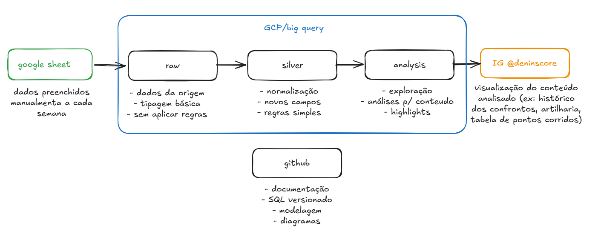

# Deninscore

Este projeto tem como objetivo criar um acompanhamento estatístico das partidas semanais de futebol entre amigos, a partir de dados registrados manualmente após cada jogo.

As estatísticas das partidas são preenchidas em uma planilha do Google Sheets e utilizadas como fonte de dados para análises e visualizações. A partir desses dados, o projeto busca gerar métricas individuais e coletivas, permitindo acompanhar o desempenho dos atletas ao longo do tempo.

O foco é disponibilizar para o grupo da pelada:
- Estatísticas por atleta
- Histórico de vitórias, derrotas e empates
- Desempenho como capitão
- Destaques positivos (MOTM – Man of the Match)
- Destaques negativos (BOTM – Bagre of the Match 😅)

Além do aspecto analítico, o projeto tem um viés de estimular o engajamento entre os participantes através de discussões, rankings informais e premiações simbólicas.

## Stack e arquitetura

A stack foi escolhida priorizando simplicidade, integração nativa e uso de recursos gratuitos:

- **Google Sheets**: entrada manual dos dados após cada partida
- **BigQuery**: armazenamento e modelagem analítica dos dados
- **Looker Studio**: visualização e dashboards
- **GitHub**: documentação do projeto, versionamento de SQL, modelagem de dados e decisões técnicas

Toda a execução ocorre no ecossistema do Google Cloud, aproveitando a integração nativa entre Google Sheets, BigQuery e Looker Studio. O GitHub é utilizado exclusivamente como repositório de documentação e organização do projeto, não sendo necessário executar código diretamente a partir dele.

## Objetivos do projeto

- Criar um histórico estruturado das partidas
- Desenvolver métricas analíticas de desempenho
- Praticar modelagem de dados e SQL em um cenário real
- Servir como projeto pessoal de portfólio em dados
- Gerar valor e entretenimento para o grupo da pelada

## Fonte de dados

Os dados são preenchidos manualmente após cada partida em uma planilha do Google Sheets.
Essa planilha é utilizada como fonte de dados bruta (raw), sendo conectada diretamente ao BigQuery por meio de uma tabela externa.

## 🔹Camada Raw (`deninscore_raw`)

A camada raw é composta por uma tabela externa no BigQuery, que aponta diretamente para a planilha do Google Sheets. Nessa etapa, não há aplicação de regras de negócio, apenas inferência automática de schema e tipagem básica.

Tabela principal: deninscore_raw.raw_participacoes

## 🔹Camada Silver (`deninscore_silver`)

Camada de padronização e organização dos dados.

- Normalização de strings
- Tipagem explícita de campos numéricos e booleanos
- Padronização de valores categóricos
- Preparação para métricas

Tabela (view) principal: deninscore_silver.participacoes

Granularidade:
> Uma linha representa um atleta participando de uma partida.

## 🔹Camada Gold (`deninscore_gold`)

Camada semântica com métricas agregadas e regras de negócio.

- Estatísticas por atleta
- Rankings
- Aproveitamento
- Métricas derivadas para consumo no Looker Studio

Essa camada é a fonte oficial dos dashboards.