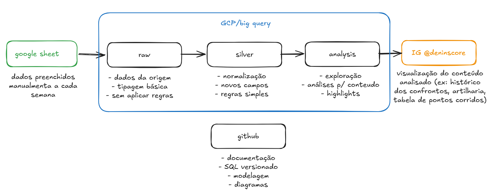

# Deninscore

Este projeto tem como objetivo estruturar e analisar dados das partidas semanais de futebol entre amigos, a partir de registros preenchidos manualmente após cada jogo.

As estatísticas das partidas são registradas em uma planilha do Google Sheets e utilizadas como fonte de dados para análises no BigQuery. A partir desses dados, o projeto busca gerar métricas individuais e coletivas que permitam contar histórias e gerar insights sobre o desempenho dos atletas ao longo do tempo.

Os resultados dessas análises são utilizados como insumo para o perfil **[@deninscore](https://instagram.com/deninscore)** no Instagram, onde são publicadas artes semanais com rankings, destaques e curiosidades da pelada.

O objetivo do projeto é gerar dados que apoiem conteúdos como:

- Time da semana  
- Tabela de pontuação  
- Artilheiros do período  
- Atletas com mais **MOTM (Man of the Match)**  
- Atletas com mais **BOTM (Bagre of the Match)**  
- Histórico de capitães  
- Confrontos entre capitães  
- Jogadores que têm melhor desempenho quando atuam juntos  
- Curiosidades estatísticas da pelada  

Além do aspecto analítico, o projeto tem o objetivo de estruturar um pequeno ecossistema de dados aplicado a um contexto real e cotidiano.

---

# Stack e arquitetura

A stack foi escolhida priorizando simplicidade, integração nativa e uso de recursos gratuitos:

- **Google Sheets** → entrada manual dos dados após cada partida  
- **BigQuery** → armazenamento e modelagem analítica dos dados  
- **GitHub** → documentação do projeto, versionamento de SQL e organização das análises  



Toda a execução ocorre no ecossistema do **Google Cloud**, aproveitando a integração nativa entre Google Sheets e BigQuery.

O GitHub é utilizado como repositório de documentação e organização das consultas SQL utilizadas nas análises.

---

# Objetivos do projeto

- Criar um histórico estruturado das partidas da pelada  
- Desenvolver consultas analíticas a partir dos dados  
- Gerar insumos estatísticos para conteúdos do perfil **@deninscore**  
- Praticar modelagem de dados e SQL em um cenário real  
- Servir como projeto pessoal de portfólio em dados  

---

# Fonte de dados

Os dados são preenchidos manualmente após cada partida em uma planilha do **Google Sheets**.

Essa planilha é utilizada como fonte de dados bruta (*raw*), sendo conectada diretamente ao **BigQuery** por meio de uma **tabela externa**.

---

# Camadas de dados

## 🔹 Camada Raw (`deninscore_raw`)

A camada raw é composta por uma tabela externa no BigQuery que aponta diretamente para a planilha do Google Sheets.

Nessa etapa não há aplicação de regras de negócio — apenas ingestão dos dados da planilha.

Características:

- Estrutura idêntica à planilha  
- Tipagem inferida automaticamente  
- Sem transformação de dados  

Tabela principal: `deninscore_raw.raw_participacoes`


---

## 🔹 Camada Silver (`deninscore_silver`)

A camada silver realiza a padronização e organização dos dados provenientes da camada raw.

Principais transformações:

- Normalização de strings  
- Tipagem explícita de campos numéricos e booleanos  
- Padronização de valores categóricos  
- Preparação da base para análises  

Tabela principal (view): `deninscore_silver.participacoes`


Granularidade:

> Uma linha representa um atleta participando de uma partida.

Essa tabela é a **base principal para todas as análises do projeto**.

---

# Camada de análises

Em vez de criar uma camada semântica ou de dashboards, o projeto utiliza consultas SQL específicas para gerar análises pontuais.

Essas consultas ficam organizadas no repositório dentro da pasta: `/sql/analysis`


Cada arquivo SQL representa uma análise ou métrica utilizada para gerar conteúdos ou insights sobre a pelada.

Exemplos de análises implementadas ou planejadas:

- ranking de pontuação geral  
- aproveitamento por atleta  
- artilheiros por período  
- jogadores com mais MOTM  
- jogadores com mais BOTM  
- histórico de capitães  
- confronto entre capitães  
- desempenho de atletas que jogam juntos  
- estatísticas por mês ou temporada  

Essas consultas podem ser reutilizadas para diferentes períodos ou recortes temporais conforme necessário.

---

# Estrutura do repositório


Cada arquivo SQL representa uma análise ou métrica utilizada para gerar conteúdos ou insights sobre a pelada.

Exemplos de análises implementadas ou planejadas:

- ranking de pontuação geral  
- aproveitamento por atleta  
- artilheiros por período  
- jogadores com mais MOTM  
- jogadores com mais BOTM  
- histórico de capitães  
- confronto entre capitães  
- desempenho de atletas que jogam juntos  
- estatísticas por mês ou temporada  

Essas consultas podem ser reutilizadas para diferentes períodos ou recortes temporais conforme necessário.

---

# Estrutura do repositório


```
deninscore
│
├── arquitetura.png
├── README.md
│
└── sql
│
├── silver
│ └── participacoes.sql
│
└── analysis
├── ranking_pontuacao.sql
├── artilharia.sql
├── botm_ranking.sql
├── capitaes_confrontos.sql
└── jogadores_que_jogam_juntos.sql
